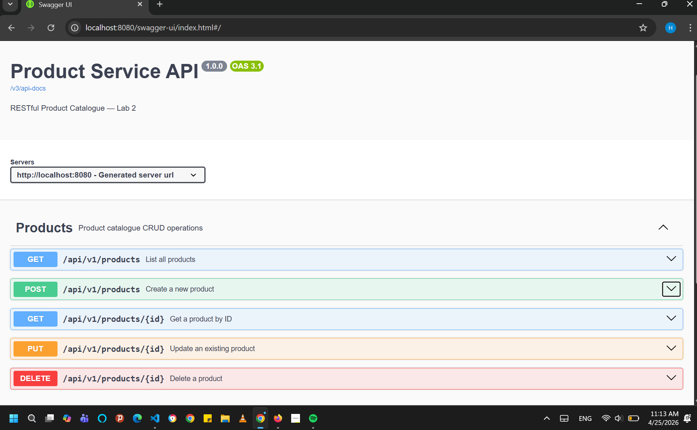

[](https://github.com/hermoges/product-service/actions/workflows/ci.yml)

# product-service


A RESTful product microservice built with Spring Boot 3.

## Getting Started

To run the application, use the following command in your terminal:

```bash

.\mvnw.cmd spring-boot:run
```

 